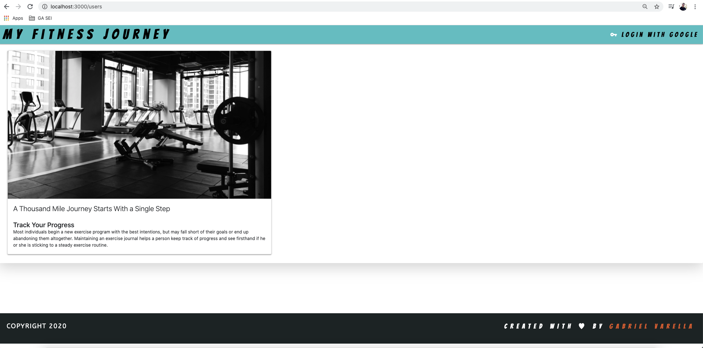
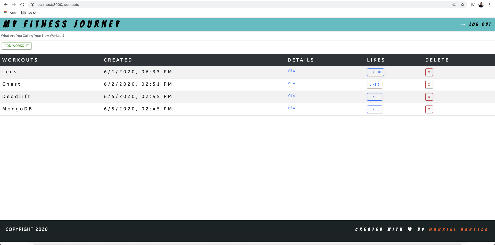
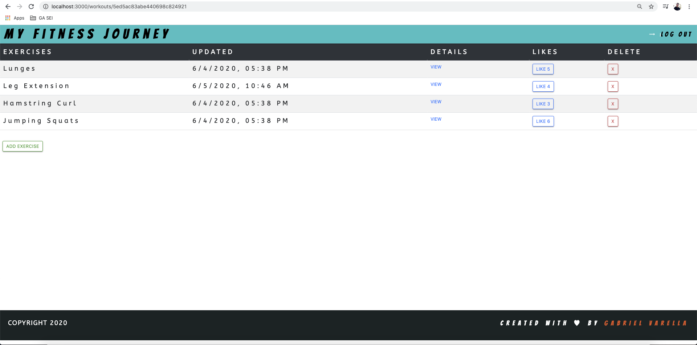
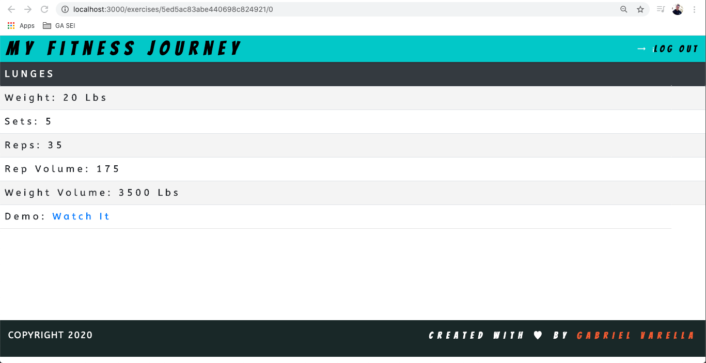

# *My Fitness Journey*

#### *By Gabriel Varella*

==>==>==>==>==>==>==>==>==>==>==>==>==>==>==>
==>==>==>==>==>==>==>==>==>==>==>==>==>==>==>

### *Date: June 9th, 2020*

==>==>==>==>==>==>==>==>==>==>==>==>==>==>==>
==>==>==>==>==>==>==>==>==>==>==>==>==>==>==>

### *Description*

Most individuals begin a new exercise program with the best intentions, but may fall short of their goals or end up abandoning them altogether. Maintaining an exercise journal helps a person keep track of progress and see firsthand if he or she is sticking to a steady exercise routine.

Start Your Fitness Journey:  https://my-fitness-journey.herokuapp.com/

==>==>==>==>==>==>==>==>==>==>==>==>==>==>==>
==>==>==>==>==>==>==>==>==>==>==>==>==>==>==>

### *Drafts, Screenshots and Progression*

Trello Board https://trello.com/b/7DkH8fWu/my-fitness-journey-project

==>==>==>==>==>==>==>==>==>==>==>==>==>==>==>
==>==>==>==>==>==>==>==>==>==>==>==>==>==>==>

### *Technologies Used*

HTML, CSS, Javascript, Node.js, Express, Mongo DB, Mongoose

==>==>==>==>==>==>==>==>==>==>==>==>==>==>==>
==>==>==>==>==>==>==>==>==>==>==>==>==>==>==>

### *Getting Started*

Login with your Google account, create a Workout and add exercises to it. You can alwasy later update the weight, numebr of reps, sets, etc.

==>==>==>==>==>==>==>==>==>==>==>==>==>==>==>
==>==>==>==>==>==>==>==>==>==>==>==>==>==>==>

### *Upcoming Features*

All users will have the hability to see and like everyone's workouts and exercices.
User will be able to make a comment on a workout or exercise.

==>==>==>==>==>==>==>==>==>==>==>==>==>==>==>
==>==>==>==>==>==>==>==>==>==>==>==>==>==>==>

### *Special Thanks*

To Crystal Vasquez, Linnae Krammer and Ben Manley. This could not be possible with out your support and patience.

==>==>==>==>==>==>==>==>==>==>==>==>==>==>==>
==>==>==>==>==>==>==>==>==>==>==>==>==>==>==>